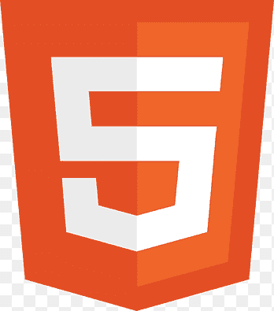
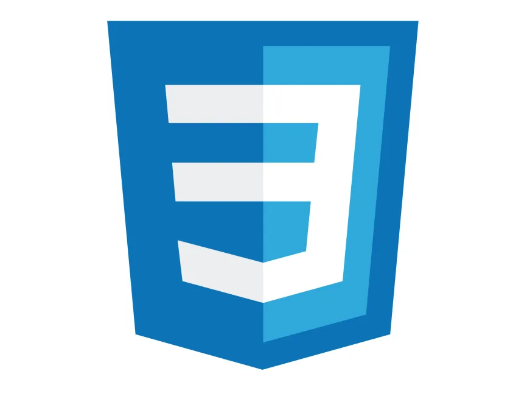

Estudiante y Desarrollador argentino

Desarrollando proyectos propios, compartiendo conocimientos y resolviendo problemas reales con codigo
------------------------------------------------------------------------------------------------------------------------------------------------------------------------------------
Sobre mi:

Soy estudiante de analisis funcional de sistemas informaticos, me apasiona la informatica y algoritmos, y estoy ampliando mis conocimientos de desarrollo Front-end y Back-end. Mejorando mis habilidades dia a dia, me encanta aprender y crear algo nuevo, productivo y innovador

🤝 Busco colaborar en proyectos de código abierto
💻 Programando con mentalidad de analista en sistemas informatico
💬 Podes pregúntarme cualquier cosa y estare encantado de ayudarte
📫 Contáctame en: aaron13780@gmail.com
------------------------------------------------------------------------------------------------------------------------------------------------------------------------------------
🛠  Stack Tecnológico

🗃  Otros

------------------------------------------------------------------------------------------------------------------------------------------------------------------------------------

🚀 Enfoque actual

Dominar los fundamentos de python y la manipulacion del DOM
Trabajando en una app de soporte con Express.js
Aprendiendo React.js + Tailwind.css
Explorando los fundamentos de la IA y redes neuronales
Aspirando a ser el mejor

'si lo puedes imaginar lo puedes programar'
------------------------------------------------------------------------------------------------------------------------------------------------------------------------------------

🤝 Hablemos

📬 Me gusta colaborar y compartir ideas, podes escribirme si:

Queres desarrollar algo juntos
Te interesa aprender programacion
Tenes dudas sobre cualquier cosa tecnica o de mis proyectos

